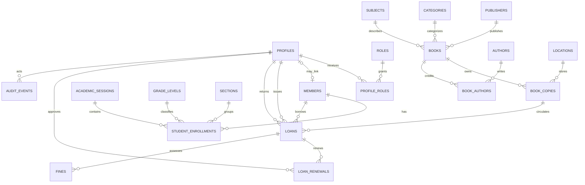

# GranthSetu V3 Domain Model

## Status and scope

This is the proposed conceptual blueprint for the next implementation phase. It is design documentation only: it contains no executable SQL, no Supabase connection, no authentication implementation, and no school data. The historical V2 client remains authoritative evidence of terminology and workflows, not a schema to copy.

## Design principles

- Keep one source of truth for each fact.
- Separate bibliographic works from owned physical copies.
- Preserve circulation and audit history even when people or inventory become inactive.
- Prefer constrained domain values and explicit events over arbitrary status strings.
- Derive availability from copy state and active loans instead of maintaining conflicting counters.
- Keep the first release appropriate for one school and a modest collection.
- Make policy values configurable without hardcoding product rules into tables or UI.
- Do not place secrets or real school data in the repository.

## Terminology

| Term | V3 meaning |
| --- | --- |
| Book | A bibliographic work/title, such as one edition or catalogue record. It is not an owned physical item. |
| Book copy | One physical item owned by the library, identified by a unique accession number. |
| Member | A person eligible to borrow from the library. A member may exist without an online account. |
| Profile | Application identity data linked to a Supabase Auth user when a login exists. |
| Loan | One circulation event for one member and one physical copy. A returned loan remains historical. |
| Academic session | A school year or equivalent period used to preserve enrollment history. |
| Policy | A configurable library rule such as loan duration or checkout limit. |

## Recommended conceptual entities

The initial relational model should contain the following entities. Names are shown as singular domain concepts; the later SQL implementation should use one consistent plural table convention and snake_case identifiers.

### Identity and membership

- **profiles**: application-owned identity linked at most once to `auth.users`; conceptual fields include `id`, `auth_user_id` nullable until an account is linked, display name, status, created/updated timestamps.
- **roles** and **profile_roles**: controlled roles assigned to profiles. Initial roles are `administrator` and `librarian`; member self-service is an extension, not an initial permission set.
- **members**: borrowing identity independent of authentication. Fields include `id`, stable member identifier, member kind (`student`, `teacher`, `staff`, or other approved value), name, minimal contact fields if genuinely required, active/inactive state, and lifecycle timestamps. A member may optionally reference a profile, but a profile is not required.
- **academic_sessions**, **grade_levels**, **sections**, and **student_enrollments**: a student member’s placement for a session. Enrollment stores the session, grade/class, section, and effective status so promotion does not rewrite old loans.

### Catalogue and physical inventory

- **books**: bibliographic record with title, ISBN where known, edition, publication year, language, subject/category references, publisher reference, description if justified, and active/archived state.
- **authors** and **book_authors**: normalized author records and ordered many-to-many relationships.
- **publishers**, **categories**, and **subjects**: controlled catalogue vocabulary where it supports searching and reporting. Category and subject are separate concepts; the first release should avoid free-text duplication.
- **locations**: shelf/room/location labels used by copies.
- **book_copies**: individual owned items with `book_id`, unique accession number, optional barcode/QR value, acquisition date/source, location, replacement cost, condition, and operational state (`active`, `maintenance`, `lost`, `damaged`, `withdrawn`). ISBN is never used as a copy identifier.

### Circulation and accountability

- **loans**: one member, one copy, issue timestamp, due timestamp/date, return timestamp, issuing profile, returning profile, canonical lifecycle state, and bounded operational notes. The loan is the historical circulation record.
- **loan_renewals**: an append-only event for each approved renewal, with loan, actor, previous due date, new due date, and event timestamp. This preserves auditability without denormalizing a renewal history into the loan.
- **fines**: optional initial-release entity associated with a loan. It stores integer minor units, ISO currency code (initial policy: INR), assessed amount, waived amount, settled amount, reason, state, and actor/timestamps. Floating-point money and mixed display currencies are prohibited.
- **audit_events**: append-only administrative history with actor profile, action, target type/ID, event time, request/correlation identifier when available, and carefully minimized metadata or before/after snapshots.
- **library_settings**: narrowly scoped library identity and policy values. Settings are named, typed, validated, versioned by update history, and restricted to authorized operators.

### Deferred unless requirements change

Reservations/holds, payments, acquisition orders, vendors, inventory stocktakes, announcements, and a separate lost/damaged incident table are not required for the first schema. Lost/damaged disposition is represented on `book_copies` and the relevant loan/audit records; a dedicated incident entity can be added if operational investigation needs it. Payments should be added only when the school approves a real settlement workflow.

## Relationships and cardinalities

- One book has zero or many book copies; every active copy belongs to exactly one book.
- One book has zero or many authors through `book_authors`; one author may be linked to many books.
- One member has zero or many loans; one loan belongs to exactly one member and one copy.
- One copy has zero or many historical loans but at most one active loan.
- One loan has zero or many renewals and zero or many fine records only where the policy permits.
- One student member has zero or many enrollments, with at most one current enrollment per academic session.
- One profile may have many roles; one role may be assigned to many profiles.
- One profile may optionally be linked to one member; member existence does not imply authentication.
- One profile may author many audit events; audit events retain actor identity independently of later role changes.

## Identifiers and constraints

- Use UUID primary keys for application entities; human-facing identifiers are separate fields.
- `members.member_identifier` is unique within the library and stable across academic sessions.
- `book_copies.accession_number` is unique across the library and is the primary physical lookup key. A barcode/QR value, when used, is also unique and is not the database primary key.
- ISBN is optional, normalized for lookup, and may repeat across many copies and catalogue records when editions differ.
- Profiles link to at most one `auth.users` row; the application must never duplicate passwords.
- Foreign keys protect relationships. Historical records use restrict/no-action semantics or archival references rather than destructive cascades.
- Required fields, non-negative integer quantities, valid dates, approved enum/domain values, and currency consistency are database constraints in the future migration.
- Enforce one active loan per copy with a partial unique constraint/index over active loan states. A transaction must also verify copy operational state and member eligibility atomically.
- Enforce one current enrollment per student/session and appropriate uniqueness for grade/section within a session.

## Academic structure

`student_enrollments` records the member’s grade/class and section for an `academic_session`. Loans reference the member and retain their own historical timestamps; reports join through the enrollment that was effective for the requested period rather than reading a mutable current class field. The exact local names for grades and session boundaries remain configurable school policy.

## Copy availability and lifecycle

Persistent copy state describes operational disposition: `active`, `maintenance`, `lost`, `damaged`, or `withdrawn`. Circulation state describes the loan: `active`, `returned`, or `cancelled` only where a pre-issue cancellation is genuinely needed. `overdue` is derived from an active loan’s due time and the current time, not a second mutable lifecycle state.

For catalogue views, a copy is:

- **available** when operational state is `active` and no active loan exists;
- **on loan** when an active loan exists;
- **unavailable** when maintenance, lost, damaged, or withdrawn;
- **reserved** only after a reservations feature is approved and implemented.

The system must not keep independently editable `available_copies` counters on the book record. Counts are derived from copies and loans.

## Circulation rules and invariants

1. A loan always identifies a specific copy, member, issue actor, issue time, and due time.
2. A copy cannot have two active loans.
3. An inactive member or non-operational copy cannot be issued.
4. Return closes the existing loan with return actor/time and does not reopen it.
5. A later borrowing of the same copy creates a new loan.
6. Renewal appends an event and extends the due date only after server-side policy checks.
7. Lost or damaged disposition does not erase the loan or audit history.
8. Historical loans remain valid if a member, book, or copy is archived.
9. Issue, return, renew, and fine changes are atomic server-side operations; UI checks are advisory only.
10. Policy values such as default loan period, maximum concurrent loans, grace period, renewal limit, and fine rate are configurable and must be evaluated at the time of the operation.

## Fines decision

Fines are retained as an optional, policy-controlled first-release capability because V2 exposes overdue/fine workflows, but the implementation must simplify and normalize them. Store amounts as integer paise (`amount_minor`) plus `currency_code = INR`; do not store floating-point values or display strings. An assessed fine may be waived or settled with separate amounts and actor history. Whether fines are enabled, the rate, grace period, and settlement policy require school approval before implementation.

## Archive and deletion strategy

Members, profiles, books, and copies are deactivated/archived rather than destructively deleted once referenced by history. Copies may be withdrawn while retaining accession and loan history. Auth users are disabled/revoked through the approved auth lifecycle; application profiles remain for audit attribution. Destructive deletion is limited to never-referenced draft/reference records, subject to explicit administrative policy. No blanket `deleted_at` column is added to every table.

## Reporting and search

Normalized records support title/copy totals, availability, active/overdue loans, lost/damaged inventory, popular titles, member activity, period circulation, class-wise reports, category inventory, member counts, and fine summaries without reporting tables in the first release. PostgreSQL indexes and full-text/trigram capabilities are sufficient initially; no Elasticsearch, Algolia, analytics database, event bus, or CQRS layer is justified.

Likely indexes include accession number, normalized ISBN, member identifier, active loans by copy/member/due date, loan history by copy/member/time, title/author search fields, and catalogue category/subject. The expected scale is one school, thousands of titles/copies, and ordinary operational reporting; the design should grow beyond that without premature enterprise infrastructure.

## Migration compatibility

The later migration must treat the V2 export as untrusted input requiring profiling. Known mapping risks from the preserved client and existing migration plan include title/copy conflation, aggregate copy counts, mixed or arbitrary statuses, missing stable IDs, duplicate members/books, incomplete dates, ambiguous class/section values, inconsistent accession identifiers, orphaned transactions, and mixed currency labels. The authoritative export, not the frontend, must determine actual source columns and records. No import or production access occurs in this phase.

## ER model

## Deferred decisions requiring explicit approval

- Exact grade/class vocabulary and academic-session dates.
- Whether member self-service and reservations belong in the first release.
- Fine enablement, INR policy, rates, waivers, and settlement workflow.
- Whether contact fields beyond a minimal operational need are required.
- Whether a dedicated stocktake, acquisition, payment, or loss/damage incident workflow is needed.
- Final policy limits: loan duration, checkout limit, renewals, grace periods, and overdue treatment.

## Safest implementation order

1. Approve this model and the unresolved school policies.
2. Provision an isolated Development Supabase project.
3. Configure Development-only environment variables.
4. Write reviewed, version-controlled migrations for identity, catalogue, copies, members, and audit foundations.
5. Implement authentication, server authorization, and RLS together.
6. Add synthetic seed data and constraint tests.
7. Build catalogue, physical inventory, and member administration.
8. Build atomic issue, return, renewal, and optional fine operations.
9. Add search and reports from normalized data.
10. Profile a sanitized authoritative export and perform a migration dry run.
11. Obtain approval for production isolation, backup, rollback, and controlled migration.
